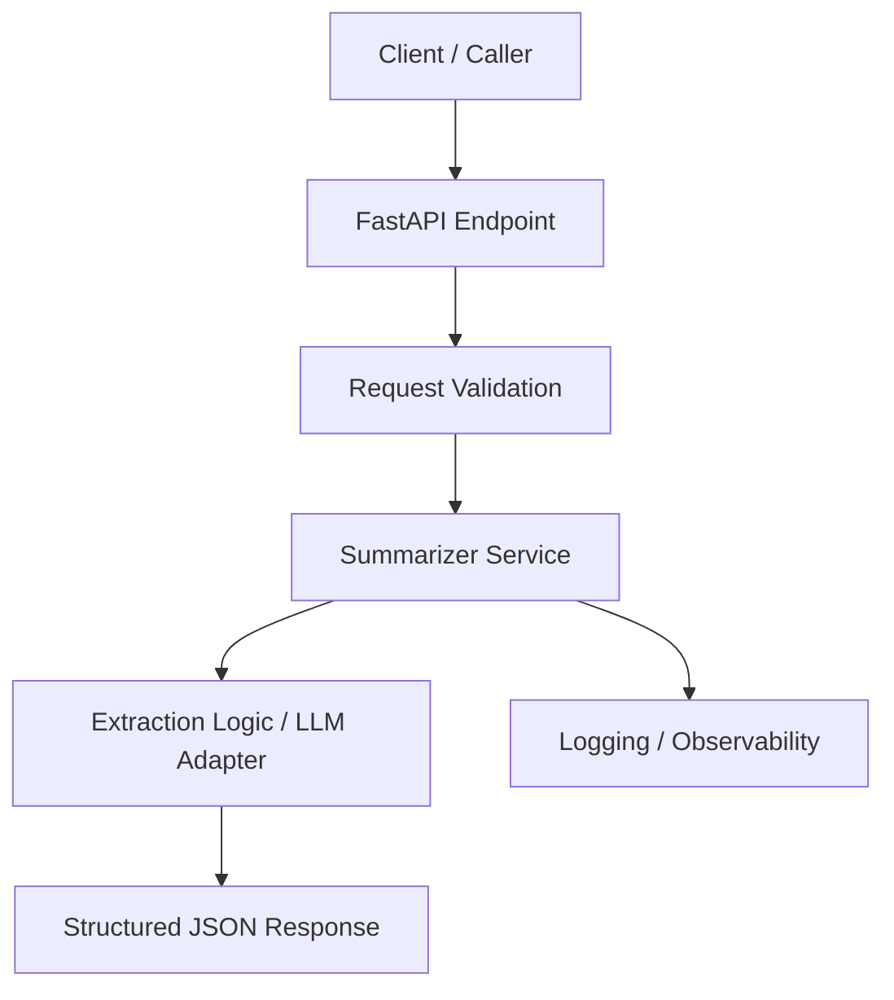

# Design Notes

This file is intentionally simple so you can generate or refine it live with Copilot.

## Problem
Convert unstructured meeting notes into:
- summary
- action items
- owners
- due dates
- risks

## Assumptions
- Input is plain text meeting notes.
- Output is structured JSON.
- Initial version can use lightweight extraction rules or a mocked AI processor.
- Production version can later integrate an LLM provider.

## Mermaid Architecture

## Proposed endpoints
- `GET /health`
- `POST /summarize`

## Notes for production discussion
- add authentication
- add trace IDs and structured logs
- persist summaries if needed
- integrate external LLM behind an adapter interface
